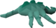

# Vorkath Rotation 
This plugin allows you to keep track of which Vorkath special attack will be next.

| NOTE: This plugin does not use any game state information about Vorkath. User input is required to make the plugin function correctly. |
|----------------------------------------------------------------------------------------------------------------------------------------|

## Instructions
The plugin requires user input to determine which special attack comes next. Begin the fight with Vorkath and select the Acid pool icon or Spawn icon in the plugin panel.
The plugin will keep track of the next special attacks from then on. Select the Reset button at the bottom once the fight is over. \

## Feedback
Feel free to open an issue in this repository to provide feedback on the plugin. Feature requests are welcome as well!
